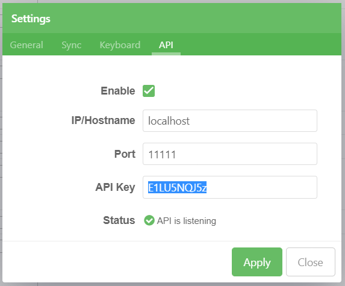
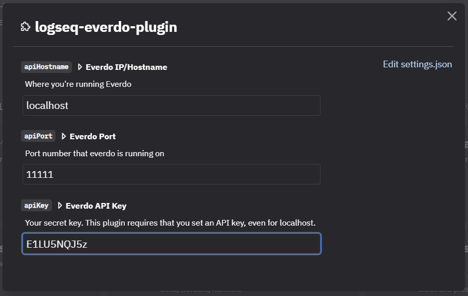

# Send to Everdo Plugin for Logseq

This plugin adds the "Send to Everdo" slash-command which sends the current block to your [Everdo](https://everdo.net) 
inbox, and then appends the `#everdo` tag to the block.  The Everdo task includes a link back to the originating block.

## Configuring Everdo

Open settings (`ctrl + ,`) > API.  Fill out the information as appropriate.  You must use an API Key.  Everdo will generate one for you if none is provided.

## Configuring the plugin

Configure the plugin with the same information that was configured in Everdo.

## Cannot connect to localhost

Everdo hosts its API using a self-signed certificate, which results in a "Could not connect" error.  Ideally, you should host your Everdo "server" behind a reverse proxy that applys a proper TLS certificate.

Alternatively, you can work around this by running logseq with the `--ignore-certificate-errors` flag.  Only do this if you understand the trade-off; you assume all risks involved.  
